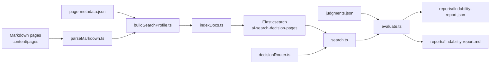

# Elastic AI Search Decision Lab

This is an independent portfolio project, not official Elastic documentation.

`elastic-ai-search-decision-lab` turns six AI search documentation drafts into a compact searchable decision system. It parses Markdown with frontmatter, enriches pages with decision metadata, indexes them into Elasticsearch, compares search strategies, and evaluates whether practitioner questions find the right guidance.

It is intentionally compact and does not use external LLM APIs. The point is to show search-quality engineering around documentation findability, not to build a frontend or a RAG chatbot.

## What It Demonstrates

- Markdown parsing with `gray-matter`
- Zod validation for metadata and judgment data
- Deterministic search metadata enrichment
- Elasticsearch mappings and bulk indexing
- Baseline body/title search versus enriched metadata search
- Optional deterministic decision routing before search
- Precision@1, MRR@3, and nDCG@3 evaluation
- JSON and Markdown report generation

## Why Findability Is A Search-Quality Problem

Documentation search is not only about matching words. Practitioners often ask decision-shaped questions: which retrieval strategy to start with, when reranking helps, whether a semantic migration requires reindexing, or how to measure a relevance change. A good docs search system needs to connect that intent to the page that contains the right guidance.

This project treats documentation findability like a small relevance lab: define judgment sets, compare retrieval strategies, and report which strategy places the best guidance highest.

## Architecture



## Local Run

```bash
npm install
docker compose up -d
npm run setup
npm run index
npm run search -- "When should I use RRF instead of linear retriever weighting?"
npm run evaluate
npm test
```

`npm run index` recreates the Elasticsearch index and indexes the six Markdown pages. `npm run evaluate` writes `reports/findability-report.json` and `reports/findability-report.md`.

## Search Strategies

- `baseline_body_title`: `multi_match` over `title^3` and `body`
- `enriched_metadata`: boosted search over `title`, `description`, `search_profile`, `topics`, `problems`, `decision_stage`, and `body`
- `decision_router`: detects a decision stage and applies deterministic boosts before running enriched search

To try a different strategy:

```bash
SEARCH_STRATEGY=decision_router npm run search -- "Can I add semantic search to an existing BM25 index without downtime?"
```

PowerShell equivalent:

```powershell
$env:SEARCH_STRATEGY="decision_router"; npm run search -- "Can I add semantic search to an existing BM25 index without downtime?"
```

## Sample Queries

- `Should I start with BM25, semantic search, hybrid search, or reranking?`
- `How do I choose between semantic_text and the inference API?`
- `When should I use RRF instead of linear retriever weighting?`
- `My vector search is slow and uses too much memory. What should I tune?`
- `How can I measure if a relevance change improved results?`
- `Can I add semantic search to an existing BM25 index without downtime?`

## Agent Access (MCP)

A **read-only** [Model Context Protocol](https://modelcontextprotocol.io) server
exposes the search and decision-router core as agent tools, built with the
official TypeScript SDK. The MCP layer is a set of **thin adapters** over the
existing `searchPages` and `routeDecision` functions — no business logic, and
provenance (`id` / `source_file` / `score`) is preserved.

Two tools are exposed:

- `search(query, strategy?, size?)` — runs the `baseline_body_title`,
  `enriched_metadata` (default), or `decision_router` strategy.
- `route_decision(query)` — the deterministic regex `DecisionStage` router.

Run it over stdio:

```bash
npm run mcp
```

See [`docs/mcp.md`](docs/mcp.md) for the tool schemas, the structured error
contract, example calls, and client registration.

## Sample Report Table

| Strategy | Precision@1 | MRR@3 | nDCG@3 |
| --- | ---: | ---: | ---: |
| baseline_body_title | generated locally | generated locally | generated locally |
| enriched_metadata | generated locally | generated locally | generated locally |
| decision_router | generated locally | generated locally | generated locally |

## Repository Layout

```text
content/pages/*.md
data/page-metadata.json
data/judgments.json
src/parseMarkdown.ts
src/buildSearchProfile.ts
src/elasticsearch.ts
src/indexDocs.ts
src/search.ts
src/evaluate.ts
src/metrics.ts
src/decisionRouter.ts
src/mcp/tools.ts
src/mcp/server.ts
src/mcp/errors.ts
docs/mcp.md
reports/findability-report.json
reports/findability-report.md
tests/*.test.ts
README.md
package.json
docker-compose.yml
```
